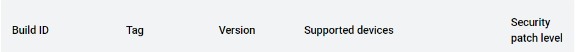
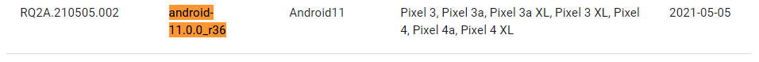
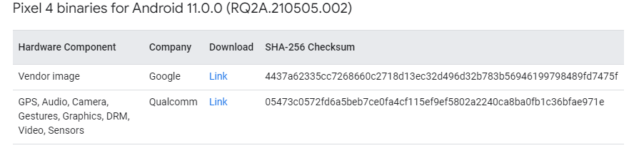
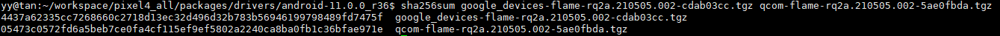
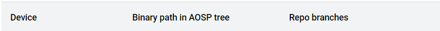
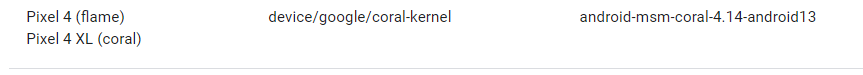
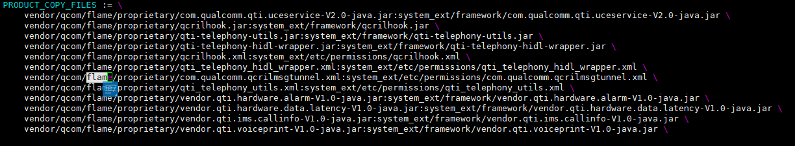
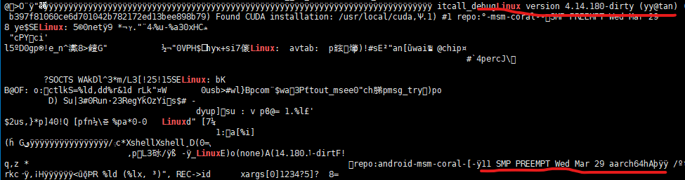
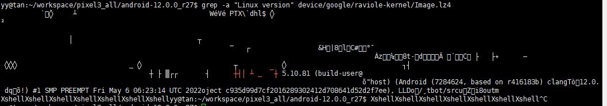
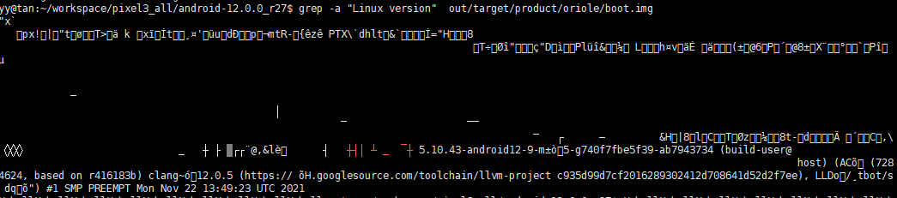

# pixel4刷android11

环境：大机房74服务器

## 1. aosp下载与编译

### 1.1 安装repo

参考 [pixel3 刷安卓12](https://github.com/Ying-Yuan07/pixel3/blob/main/pixel3%20%E5%88%B7%E5%AE%89%E5%8D%9312.md)

https://source.android.com/docs/setup/download#installing-repo

### 1.2 初始化本地仓库

https://source.android.com/docs/setup/download/downloading

#### **确认aosp版本**

查看pixel 4 支持的系统版本https://source.android.com/docs/setup/about/build-numbers#source-code-tags-and-builds ，选择`android-11.0.0_r36`(随便选一个吧)，该版本对应的`Build ID`为`RQ2A.210505.002`






#### 将下载源切换到中科大

1）查看是否有REPO_URL环境变量，若有，将其修改为`https://gerrit.googlesource.com/git-repo`

```shell
#在~/.bashrc中添加 export REPO_URL="https://gerrit-googlesource.proxy.ustclug.org/git-repo"
vim ~/.bashrc
#使环境变量生效
source ~/.bashrc
```


#### 拉取aosp源码

```shell
cd ~/workspace/pixel4_all/android
mkdir android-11.0.0_r36  
cd android-11.0.0_r36 
~/.bin/repo init -u git://mirrors.ustc.edu.cn/aosp/platform/manifest -b android-11.0.0_r36
~/.bin/repo sync -j4 
```

### 1.3 二进制驱动下载与安装

#### 下载

在官网[驱动库](https://developers.google.com/android/drivers)中查找`pixel4:android-11.0.0_r36（RQ2A.210505.002）`的[二进制驱动](https://developers.google.com/android/drivers#flamerq2a.210505.002)



```shell
#dowload drivers package
cd ~/workspace/pixel4_all/packages/drivers/android-11.0.0_r36
wget https://dl.google.com/dl/android/aosp/google_devices-flame-rq2a.210505.002-cdab03cc.tgz
wget https://dl.google.com/dl/android/aosp/qcom-flame-rq2a.210505.002-5ae0fbda.tgz
#check package,确认下载正确
sha256sum google_devices-flame-rq2a.210505.002-cdab03cc.tgz qcom-flame-rq2a.210505.002-5ae0fbda.tgz
```




#### **安装二级制驱动**

```shell
cd ~/workspace/pixel4_all/packages/drivers/android-11.0.0_r36
tar -xvf google_devices-flame-rq2a.210505.002-cdab03cc.tgz -C ~/workspace/pixel4_all/android/android-11.0.0_r36
tar -xvf qcom-flame-rq2a.210505.002-5ae0fbda.tgz -C ~/workspace/pixel4_all/android/android-11.0.0_r36
cd ~/workspace/pixel4_all/android/android-11.0.0_r36
./extract-google_devices-flame.sh
./extract-qcom-flame.sh
```

输入`I ACCEPT`

### 1.4.编译aosp11

#### 查看pixel4 对应的内核版本

查看pixel4内核分支 https://source.android.com/docs/setup/build/building-kernels  ，pixel4 对应的内核分支为`msm-coral` :   https://android.googlesource.com/kernel/msm/+refs  ,   设备代号为`flame`，AOSP中pixel4的二进制文件在`device/google/coral-kernel`路径下，即后文编译好kernel生成的`Image-lz4`需要被拷贝到该路径，另外`Repo branches`表示当前设备支持的最高内核版本，即`android-msm-coral-4.14-android13`





查看pixel4-andriod11具体的[内核版本号](https://android.googlesource.com/kernel/msm/+refs) ：**[android-msm-coral-4.14-android11](https://android.googlesource.com/kernel/msm/+/refs/heads/android-msm-coral-4.14-android11)** ，则make aosp的内核的版本为4.14(aosp编译时指定的版本最好与内核版本一致，高于4.14是刷不进手机的，低于4.14没有试过)

```shell
cd ~/workspace/pixel4_all/android/android-11.0.0_r36
source build/envsetup.sh
lunch aosp_flame-userdebug
make TARGET_KERNEL_USE=4.14 -j64 RELAX_USES_LIBRARY_CHECK=true
```

注：`lunch aosp_xxx-userdebug` ,`xxx`为 google为每一个机型取的代号，pixel4 为`oriole`，可以通过`lunch`指令查看aosp支持的设备与编译版本

清除编译结果

```
make clobber
```


#### 查看生成的内核版本

#todo

```shell
~/workspace/pixel4_all/android/android-11.0.0_r36/device/google/coral-kernel
grep -a "Linux" Image.lz4
```


#### 问题：编译过程可能报找不到vendor/qcom/coral/proprietary/com.qualcomm.qcrilmsgtunnel.xml

解决：在`/vendor`路径下执行`grep -r "vendor/qcom/coral/proprietary/com.qualcomm.qcrilmsgtunnel.xml" ./` , 发现在`/vendor/qcom/flame/device-partial.mk`中`PRODUCT_COPY_FILES`字段赋值了`vendor/qcom/coral/proprietary/com.qualcomm.qcrilmsgtunnel.xml`,其中`coral`是pixel4L的设备号，在这里将其修改成`flame`




### 1.5.烧录aosp11镜像

```
cd aosp9/out/target/product/blueline
adb reboot bootloader
fastboot flashall -w
```


查看是否烧录成功

```shell
PS C:\Users\Administrator> adb shell uname -a
Linux localhost 5.10.43-android12-9-00005-g740f7fbe5f39-ab7943734 #1 SMP PREEMPT Mon Nov 22 13:49:23 UTC 2021 aarch64
```


## 2 kernel

**android-gs-raviole-5.10-android12-qpr3**


查看需要的内核版本https://source.android.com/setup/build/building-kernels，

我们选择pixel6对应分支： **android-gs-raviole-5.10-android12-qpr3**；

### 2.1 下载内核代码

#### 将下载源切换回google

1）查看是否有REPO_URL环境变量，若有，将其修改为`https://gerrit.googlesource.com/git-repo`

```shell
#在~/.bashrc中添加 export REPO_URL="https://gerrit.googlesource.com/git-repo"
vim ~/.bashrc
#使环境变量生效
source ~/.bashrc
```


2）从google官网拉取kernel源码

从谷歌官网拉代码需要翻墙，参考https://igghelper.com/helper/?p=257，其中[Qv2ray](https://github.com/Qv2ray/Qv2ray/releases/tag/v2.7.0)从[git](https://github.com/Qv2ray/Qv2ray/releases)上下载[Qv2ray-v2.7.0-linux-x64.AppImage](https://github.com/Qv2ray/Qv2ray/releases/download/v2.7.0/Qv2ray-v2.7.0-linux-x64.AppImage)版本，下载之后给其赋权限`chmod u+x Qv2ray-v2.7.0-linux-x64.AppImage `,双击该文件，打开Qv2ray,配置ghelper 中的**通用订阅链接**

```bash
mkdir -p kernel/android-gs-raviole-5.10-android12-qpr3
cd kernel/android-gs-raviole-5.10-android12-qpr3 
 ~/.bin/repo init -u https://android.googlesource.com/kernel/manifest -b android-gs-raviole-5.10-android12-qpr3
~/.bin/repo sync -j4
```

拉取下来的kernel与工具如下


#### 问题1 执行~/.bin/repo init 报错，fatal: cannot get https://gerrit.googlesource.com/git-repo/clone.bundle

解决方案：

1）手动下载

```shell
cd ~/opt
wget https://gerrit.googlesource.com/git-repo/clone.bundle .
```

2）执行~/.bin/repo init时指定已下载的clone.bundle，比如放在~/opt路径下

```shell
 ~/.bin/repo init -u https://android.googlesource.com/kernel/manifest -b android-gs-raviole-5.10-android12-qpr3 --repo-url ~/opt/clone.bundle
```

#### 问题2  执行~/.bin/repo sync 报错，fatal：无法访问`https://android.googlesource.com/kernel/...`

**解决方案1**：可能是用过代理，取消代理

```shell
git config  --global --unset http.proxy
```

可能还是解决不了，那就忽略，等`repo sync`执行完成之后，就直接编译内核

**解决方案2**：可能是因为并发数太高，官方kernel库没有及时响应[1]，将并发线程最高限制为4，重新执行`~/.bin/repo sync -j4`指令，由于repo支持断点续传，可以继续从上次出错的地方重新拉代码


#### 问题3 repo sync 拉下来的代码不全

https://www.cnblogs.com/wi100sh/p/4535421.html

同问题2-解决方案2


#### 问题 4 查看拉下来的代码状态

https://blog.csdn.net/wh_19910525/article/details/8164107

```shell
cd 
~/.bin/repo status
```


#### 问题5 repo--提示“A new version of repo is available”

**方案1**

https://blog.csdn.net/qq_40222981/article/details/120708146
1.repo是可以自我升级的
2“出错原因是曾使用repo [sync](https://so.csdn.net/so/search?q=sync&spm=1001.2101.3001.7020)从其它库sync过代码，删掉~/.repoconfig即可”

**方案2**

重装repo，参考 [pixel3 刷安卓12](https://github.com/Ying-Yuan07/pixel3/blob/main/pixel3%20%E5%88%B7%E5%AE%89%E5%8D%9312.md)

**方案3**

https://www.cnblogs.com/yayagepei/articles/2753253.html

```shell
repo init --repo-url https://android.googlesource.com/tools/repo -u http://android.googlesource.com/platform/manifest -b android-2.3.3_r1
```


### 2.2 编译内核代码

查看详细内核版本

```shell
cd ~/workspace/pixel3_all/android-12.0.0_r27
source build/envsetup.sh
lunch 
#选择pixel 6对应的版本
cd ../kernel/android-gs-raviole-5.10-android12-qpr3
build/build.sh 
```

`android-gs-raviole-5.10-android12-qpr3`对应内核字版本号为`5.10.81`,可以通过比对手机内核版本号来确认内核是否成功烧录到手机里

#### 查看生成的内核版本

```shell
~/workspace/pixel4_all/kernel/android-11.0.0_r36/device/google/coral-kernel
grep -a "Linux" Image.lz4
```

内核版本为`4.14.180-dirty`编译时间为Mar 29




内核编译成功后，将生成的Image.lz4拷贝到aosp12对应目录下，重新编译，将userdata.img的文件系统设置为f2fs

https://zhuanlan.zhihu.com/p/53009043

```bash
cp ~/workspace/pixel3_all/kernel/android-gs-raviole-5.10-android12-qpr3/out/android-gs-pixel-5.10/dist/Image.lz4 ~/workspace/pixel3_all/android-12.0.0_r27/device/google/raviole-kernel/
cd ~/workspace/pixel3_all/android-12.0.0_r27
make BOARD_USERDATAIMAGE_FILE_SYSTEM_TYPE=f2fs TARGET_USERIMAGES_USE_F2FS=true -j4 
```


##### 问题1 手机内核版本与aosp自带的kernel版本一致，与新编译的内核版本不一致

猜想1:没有将Image.lz4编译进aosp的镜像

Image.lz4版本是5.10.81




aosp生成的版本是5.10.43！！！！编译失败





## 2.4 烧录内核代码


## refs

[1]Android 镜像使用帮助, https://mirrors.tuna.tsinghua.edu.cn/help/AOSP/ .

[2]Android12 Kernel编译与启动, https://coderfan.net/android12-kernel-compile-and-start.html ,2022.11.1