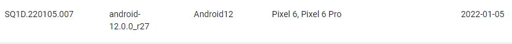
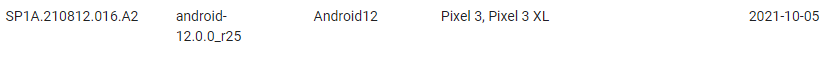
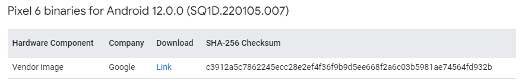

# pixel6 刷 android 12

环境：大机房74服务器

## 1. aosp下载与编译

### 1.1 安装repo

参考 [pixel3 刷安卓12](https://github.com/Ying-Yuan07/pixel3/blob/main/pixel3%20%E5%88%B7%E5%AE%89%E5%8D%9312.md)

### 1.2 初始化本地仓库

查看pixel 6支持的系统版本https://source.android.com/docs/setup/about/build-numbers#source-code-tags-and-builds，与`pixel3（android-12.0.0_r25）`比较接近的安卓12版本为





```shell
mkdir aosp12   
cd aosp12 
~/.bin/repo init -u git://mirrors.ustc.edu.cn/aosp/platform/manifest -b android-12.0.0_r27
~/.bin/repo sync -j4 
```

### 1.3 二进制驱动下载与安装

#### 下载

在官网[驱动库](https://developers.google.com/android/drivers)中查找`pixel6:android-12.0.0_r25（SQ1D.220105.007）`的[二进制驱动](https://developers.google.com/android/drivers#oriolesq1d.220105.007)



```shell
#dowload drivers package
cd ~/workspace/pixel3_all/packsges/drivers/
wget https://dl.google.com/dl/android/aosp/google_devices-oriole-sq1d.220105.007-37e46fa2.tgz
#check package
yy@tan:~/workspace/pixel3_all/packsges/drivers$ sha256sum google_devices-oriole-sq1d.220105.007-37e46fa2.tgz 
c3912a5c7862245ecc28e2ef4f36f9b9d5ee668f2a6c03b5981ae74564fd932b  google_devices-oriole-sq1d.220105.007-37e46fa2.tgz
```

注：从pixel6开始，驱动只保留了`Google自己开发的 Vendor image:extract-google_devices-oriole.sh`删掉了第三方高通Qualcomm开发的`GPS, Audio, Camera, Gestures, Graphics, DRM, Video, Sensors驱动`

#### **安装二级制驱动**

```shell
tar -xvf google_devices-oriole-sq1d.220105.007-37e46fa2.tgz -C ~/workspace/pixel3_all/aosp12_0.0_r27/
cd ~/workspace/pixel3_all/aosp12_0.0_r27/
./extract-google_devices-oriole.sh
```

输入`I ACCEPT`

### 4.编译aosp12

查看pixel6 android12 对应的内核版本https://source.android.com/docs/setup/build/building-kernels，这里表示的是最高版本


从https://android.googlesource.com/kernel/查看具体的[内核版本号](https://android.googlesource.com/kernel/gs/+refs)：**android-gs-raviole-5.10-android12-qpr3**，则make的内核的版本为5.10，

怎么知道aosp的版本与哪个kernel对应，还是只要是安卓12能对上就行？？？


```shell
cd ~/workspace/pixel3_all/aosp12_0.0_r27/
source build/envsetup.sh
lunch aosp_oriole-userdebug 
make TARGET_KERNEL_USE=5.10 -j64 RELAX_USES_LIBRARY_CHECK=true
```

注：`lunch aosp_xxx-userdebug` ,`xxx`为 google为每一个机型取的代号，pixel6 为`oriole`

清除编译结果

```
make clobber
```

### 5.烧录aosp12镜像

#todo

```
cd aosp9/out/target/product/blueline
adb reboot bootloader
fastboot flashall -w
```