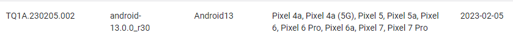
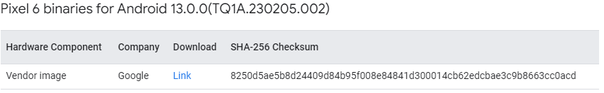
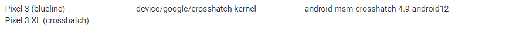

# pixel6 刷 android 13

环境：大机房74服务器

## 1. aosp下载与编译

### 1.1 安装repo

参考 [pixel3 刷安卓12](https://github.com/Ying-Yuan07/pixel3/blob/main/pixel3%20%E5%88%B7%E5%AE%89%E5%8D%9312.md)

### 1.2 初始化本地仓库

查看pixel 6支持的系统版本https://source.android.com/docs/setup/about/build-numbers#source-code-tags-and-builds，选择一个适配多种机型的android 13版本号`android-13.0.0_r30`



```shell
mkdir android-13.0.0_r30   
cd android-13.0.0_r30
~/.bin/repo init -u git://mirrors.ustc.edu.cn/aosp/platform/manifest -b android-13.0.0_r30
~/.bin/repo sync -j4 
```

### 1.3 二进制驱动下载与安装

#### 下载

在官网[驱动库](https://developers.google.com/android/drivers)中查找`Pixel 6 binaries for Android 13.0.0(TQ1A.230205.002)`的[二进制驱动](https://developers.google.com/android/drivers#orioletq1a.230205.002)



```shell
#dowload drivers package
cd ~/workspace/pixel3_all/packsges/drivers/android-13.0.0_r30/pixel6
wget https://dl.google.com/dl/android/aosp/google_devices-oriole-tq1a.230205.002-ab978668.tgz
#check package
yy@tan:~/workspace/pixel3_all/packsges/drivers$ sha256sum google_devices-oriole-tq1a.230205.002-ab978668.tgz 
8250d5ae5b8d24409d84b95f008e84841d300014cb62edcbae3c9b8663cc0acd  google_devices-oriole-tq1a.230205.002-ab978668.tgz
```

注：从pixel6开始，驱动只保留了`Google自己开发的 Vendor image:extract-google_devices-oriole.sh`删掉了第三方高通Qualcomm开发的`GPS, Audio, Camera, Gestures, Graphics, DRM, Video, Sensors驱动`

##

#### **安装二级制驱动**

```shell
cd ~/workspace/pixel3_all/packsges/drivers/android-13.0.0_r30/pixel6
tar -xvf google_devices-oriole-tq1a.230205.002-ab978668.tgz -C ~/workspace/pixel3_all/android-13.0.0_r30/
cd ~/workspace/pixel3_all/android-13.0.0_r30/
./extract-google_devices-oriole.sh
```

输入`I ACCEPT`

### 4.编译aosp12

查看pixel6 android12 对应的内核版本https://source.android.com/docs/setup/build/building-kernels，这里表示的是最高版本




从https://android.googlesource.com/kernel/查看具体的[内核版本号](https://android.googlesource.com/kernel/gs/+refs)：**android-gs-raviole-5.10-android13-qpr1**，则make的内核的版本为5.10，


```shell
cd ~/workspace/pixel3_all/android-13.0.0_r30/
source build/envsetup.sh
lunch aosp_oriole-userdebug 
make TARGET_KERNEL_USE=5.10 -j64 RELAX_USES_LIBRARY_CHECK=true
```

注：`lunch aosp_xxx-userdebug` ,`xxx`为 google为每一个机型取的代号，pixel6 为`oriole`

清除编译结果

```
make clobber
```

### 5.烧录aosp12镜像

#todo

```
cd android-13.0.0_r30/out/target/product/blueline
adb reboot bootloader
fastboot flashall -w
```


