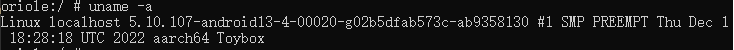
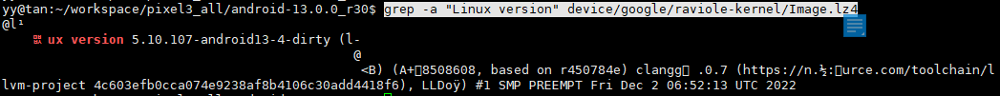
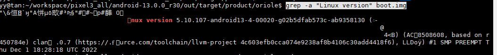

# pixel6 刷 android 13

环境：大机房74服务器

## 1. aosp下载与编译

### 1.1 安装repo

参考 [pixel3 刷安卓12](https://github.com/Ying-Yuan07/pixel3/blob/main/pixel3%20%E5%88%B7%E5%AE%89%E5%8D%9312.md)

### 1.2 初始化本地仓库

查看pixel 6支持的系统版本https://source.android.com/docs/setup/about/build-numbers#source-code-tags-and-builds，选择一个适配多种机型的android 13版本号`android-13.0.0_r30`


```shell
mkdir android-13.0.0_r30   
cd android-13.0.0_r30
~/.bin/repo init -u git://mirrors.ustc.edu.cn/aosp/platform/manifest -b android-13.0.0_r30
~/.bin/repo sync -j4 
```

### 1.3 二进制驱动下载与安装

#### 下载

在官网[驱动库](https://developers.google.com/android/drivers)中查找`Pixel 6 binaries for Android 13.0.0(TQ1A.230205.002)`的[二进制驱动](https://developers.google.com/android/drivers#orioletq1a.230205.002)


```shell
#dowload drivers package
cd ~/workspace/pixel3_all/packsges/drivers/android-13.0.0_r30/pixel6
wget https://dl.google.com/dl/android/aosp/google_devices-oriole-tq1a.230205.002-ab978668.tgz
#check package
yy@tan:~/workspace/pixel3_all/packsges/drivers$ sha256sum google_devices-oriole-tq1a.230205.002-ab978668.tgz 
8250d5ae5b8d24409d84b95f008e84841d300014cb62edcbae3c9b8663cc0acd  google_devices-oriole-tq1a.230205.002-ab978668.tgz
```

注：从pixel6开始，驱动只保留了`Google自己开发的 Vendor image:extract-google_devices-oriole.sh`删掉了第三方高通Qualcomm开发的`GPS, Audio, Camera, Gestures, Graphics, DRM, Video, Sensors驱动`

##

#### **安装二级制驱动**

```shell
cd ~/workspace/pixel3_all/packsges/drivers/android-13.0.0_r30/pixel6
tar -xvf google_devices-oriole-tq1a.230205.002-ab978668.tgz -C ~/workspace/pixel3_all/android-13.0.0_r30/
cd ~/workspace/pixel3_all/android-13.0.0_r30/
./extract-google_devices-oriole.sh
```

输入`I ACCEPT`

### 1.4 编译aosp13

查看pixel6 android13 对应的内核版本https://source.android.com/docs/setup/build/building-kernels，这里表示的是最高版本


从https://android.googlesource.com/kernel/查看具体的[内核版本号](https://android.googlesource.com/kernel/gs/+refs)：**android-gs-raviole-5.10-android13-qpr1**，则make的内核的版本为5.10，


```shell
cd ~/workspace/pixel3_all/android-13.0.0_r30/
source build/envsetup.sh
lunch aosp_oriole-userdebug
export WITH_DEXPREOPT=false
make TARGET_KERNEL_USE=5.10 -j64 RELAX_USES_LIBRARY_CHECK=true
```

注：`lunch aosp_xxx-userdebug` ,`xxx`为 google为每一个机型取的代号，pixel6 为`oriole`

清除编译结果

```
make clobber
```

### 1.5 烧录aosp13镜像

```shell
cd android-13.0.0_r30/out/target/product/oriole
adb reboot bootloader
#1 将两个slot都刷成最新的系统
fastboot flash bootloader --slot=all bootloader.img 
#2 刷入所有的镜像
fastboot flashall -w
```

**【重要！！！】**

Pixel6用的谷歌的Tensor CPU，里面有个刷机计数器，一旦刷过安卓13，这个计数器就永远不会回退，一旦检测到安卓12的bootloader，就会锁死
系统成砖。问题是一日刷入安卓13.两个slot里只有一个会随系统更新为安卓13的bootloader，剩下的一个slot还是安卓12的。所以后面可以通过删除刷机包中的bootloader文件强制刷入和运行安卓12(见:https://t.zsxq.com/0aGLxz8ei)，这个安卓12会在安卓13的bootloader上正常运行，但是这个安卓12也会有各种莫名其妙的问题。

查看是否刷新成功，打开手机的`setting`-`system`-`Abount phone`-`Build Number`，可以看到当前安卓的版本，即编译的指定版本`TQ1A.230205.002`


查看手机内核版本

```shell
adb shell #进入手机shell
uname -a #查看内核版本
```




## **2.拉取kernel代码并编译**

查看需要的内核版本https://source.android.com/setup/build/building-kernels，

我们选择pixel6对应分支： android-gs-raviole-5.10-android13-qpr1；

### 2.1 下载内核代码

#### 将下载源切换回google

1）查看是否有REPO_URL环境变量，若有，将其修改为`https://gerrit.googlesource.com/git-repo`

```shell
#在~/.bashrc中添加 export REPO_URL="https://gerrit.googlesource.com/git-repo"
vim ~/.bashrc
#使环境变量生效
source ~/.bashrc
```

2）从google官网拉取kernel源码

从谷歌官网拉代码需要翻墙，参考https://igghelper.com/helper/?p=257， 其中[Qv2ray](https://github.com/Qv2ray/Qv2ray/releases/tag/v2.7.0) 从[git ](https://github.com/Qv2ray/Qv2ray/releases)  上下载[Qv2ray-v2.7.0-linux-x64.AppImage](https://github.com/Qv2ray/Qv2ray/releases/download/v2.7.0/Qv2ray-v2.7.0-linux-x64.AppImage)  版本，下载之后给其赋权限 `chmod u+x Qv2ray-v2.7.0-linux-x64.AppImage `, 双击该文件，打开Qv2ray,配置ghelper 中的**通用订阅链接**

```bash
mkdir -p kernel/android-gs-raviole-5.10-android13-qpr1
cd kernel/android-gs-raviole-5.10-android13-qpr1 
 ~/.bin/repo init -u https://android.googlesource.com/kernel/manifest -b android-gs-raviole-5.10-android13-qpr1
~/.bin/repo sync -j8
```

拉取下来的kernel与工具如下


**问题1 执行~/.bin/repo init 报错，fatal: cannot get https://gerrit.googlesource.com/git-repo/clone.bundle**

解决方案：

1）手动下载

```shell
wget https://gerrit.googlesource.com/git-repo/clone.bundle
```

2）执行~/.bin/repo init时指定已下载的clone.bundle，比如放在~/opt路径下

```shell
 ~/.bin/repo init -u https://android.googlesource.com/kernel/manifest -b android-gs-raviole-5.10-android13-qpr1 --repo-url ~/opt/clone.bundle
```

**问题2  执行~/.bin/repo sync 报错，fatal：无法访问`https://android.googlesource.com/kernel/...`**

解决方案：可能是用过代理，取消代理

```shell
git config  --global --unset http.proxy
```

可能还是解决不了，那就忽略，等`repo sync`执行完成之后，就直接编译内核

### 2.2 编译kernel

#### Update the vendor ramdisk[4]

##### Copy the `vendor_ramdisk` from a locally built Android platform repository.

| Device                               | DEVICE_RAMDISK_PATH                                          |
| :----------------------------------- | :----------------------------------------------------------- |
| Pixel 6 (oriole) Pixel 6 Pro (raven) | prebuilts/boot-artifacts/ramdisks/vendor_ramdisk-**oriole.img** |
| Pixel 6a (bluejay)                   | private/devices/google/bluejay/vendor_ramdisk-**bluejay.img** |

```{.devsite-terminal
cp ANDROID_ROOT/out/target/product/DEVICE/vendor_ramdisk-debug.img \
   KERNEL_REPO_ROOT/DEVICE_RAMDISK_PATH/vendor_ramdisk-DEVICE.img
```


#### 编译方式一

```bash
#1 首先我们在AOSP源码目录下准备好编译环境 ,用于启动一些编译时所需要的环境变量，例如：交叉编译工具等
cd ~/workspace/pixel3_all/android-13.0.0_r30/
source build/envsetup.sh
lunch aosp_oriole-userdebug
#2 build kernel
cd ~/workspace/pixel3_all/kernel/android-gs-raviole-5.10-android13-qpr1
KBUILD_BUILD_VERSION=1 KBUILD_BUILD_USER=build-user KBUILD_BUILD_HOST=build-host KBUILD_CONFIG=private/gs-google/build.config.aarch64 build/build.sh
```

大概需要编译一个半小时

#### 编译方式二【Failed】

安卓13 已经抛弃了`build/build.sh`[1],采用`bazel `,但是我们从goole拉下来的kernel中没有common目录！！，

```shell
cd ~/workspace/pixel3_all/android-13.0.0_r30/
source build/envsetup.sh
lunch aosp_oriole-userdebug

tools/bazel build //common:kernel_aarch64_dist
```


### 2.3 重新编译aosp

#### 2.3.1**将编译好的Image.lz4-dtb拷贝到AOSP**

2.2中编译好的内核二进制文件、模块和相应的映像位于 `out/BRANCH/dist` 目录下，将Image.lz4-dtb拷贝到Android13系统源码的`device/google/raviole-kernel`目录下，   

```bash
cp ~/workspace/pixel3_all/kernel/android-gs-raviole-5.10-android13-qpr1/out/android13-gs-pixel-5.10-gs101/dist/Image.lz4 ~/workspace/pixel3_all/android-13.0.0_r30/device/google/raviole-kernel
```


#### 2.3.2**删除AOSP原生的**`boot.img`与`boot-user.img`

删除ANDROID_TARGET_KERNEL路径下`boot.img`与`boot-user.img`，如果不删除这两个文件，aosp在编译时根据上述两个文件生成的kernel镜，就不将Image.lz4编译进内核镜像

```shell
ANDROID_TARGET_KERNEL：android-13.0.0_r30/device/google/raviole-kernel
ANDROID_PRODUCT_OUT：android-13.0.0_r30/out/target/product/oriole
```

#### 2.3.3**重新编译aosp**

```bash
cd ~/workspace/pixel3_all/android-13.0.0_r30/
source build/envsetup.sh
lunch aosp_oriole-userdebug 
export WITH_DEXPREOPT=false
make BOARD_USERDATAIMAGE_FILE_SYSTEM_TYPE=f2fs TARGET_USERIMAGES_USE_F2FS=true ART_TARGET_ANDROID=true -j4
```


#### 2.3.4**重新刷机**

**【重要！！！】**

Pixel6用的谷歌的Tensor CPU，里面有个刷机计数器，一旦刷过安卓13，这个计数器就永远不会回退，一旦检测到安卓12的bootloader，就会锁死
系统成砖。问题是一日刷入安卓13.两个slot里只有一个会随系统更新为安卓13的bootloader，剩下的一个slot还是安卓12的。所以后面可以通过删除刷机包中的bootloader文件强制刷入和运行安卓12(见:https://t.zsxq.com/0aGLxz8ei)，这个安卓12会在安卓13的bootloader上正常运行，但是这个安卓12也会有各种莫名其妙的问题。

```shell
#1 将两个slot都刷成最新的系统
fastboot flash bootloader --slot=all bootloader.img 
#2 刷入所有的镜像
fastboot flashall -w
```


```bash
#fastboot flashall -w
cd ~/workspace/pixel3_all/android-13.0.0_r30/out/target/product/oriole #或者将该路径下的img文件拷贝到windows环境（需要配置ANDROID_PRODUCT_OUT环境变量，fastboot flashall刷新的是） 
adb reboot bootloader
fastboot flashall -w
--------------------------------------------
Bootloader Version...: slider-1.2-8085990
Baseband Version.....: g5123b-97927-220225-B-8226700
Serial Number........: 22161FDF6003P4
--------------------------------------------
Checking 'product'                                 OKAY [  0.000s]
Setting current slot to 'a'                        OKAY [  0.063s]
Sending 'boot_a' (65536 KB)                        OKAY [  1.964s]
Writing 'boot_a'                                   OKAY [  0.078s]
Sending 'dtbo_a' (16384 KB)                        OKAY [  0.469s]
Writing 'dtbo_a'                                   OKAY [  0.016s]
Sending 'pvmfw_a' (1024 KB)                        OKAY [  0.031s]
Writing 'pvmfw_a'                                  OKAY [  0.000s]
Sending 'vbmeta_a' (8 KB)                          OKAY [  0.000s]
Writing 'vbmeta_a'                                 OKAY [  0.000s]
Sending 'vbmeta_system_a' (4 KB)                   OKAY [  0.000s]
Writing 'vbmeta_system_a'                          OKAY [  0.000s]
Sending 'vendor_boot_a' (65536 KB)                 OKAY [  1.859s]
Writing 'vendor_boot_a'                            OKAY [  0.078s]
Rebooting into fastboot                            OKAY [  0.000s]
< waiting for any device >
Sending 'super' (4 KB)                             OKAY [  0.004s]
Updating super partition                           OKAY [  0.015s]
Resizing 'product_a'                               OKAY [  0.000s]
Resizing 'system_a'                                OKAY [  0.008s]
Resizing 'system_ext_a'                            OKAY [  0.000s]
Resizing 'system_b'                                OKAY [  0.010s]
Resizing 'vendor_a'                                OKAY [  0.000s]
Resizing 'vendor_dlkm_a'                           OKAY [  0.000s]
Resizing 'vendor_b'                                OKAY [  0.000s]
Invalid sparse file format at header magic
Resizing 'product_a'                               OKAY [  0.000s]
Sending sparse 'product_a' 1/2 (262140 KB)         OKAY [  6.901s]
Writing 'product_a'                                OKAY [  0.392s]
Sending sparse 'product_a' 2/2 (93148 KB)          OKAY [  2.459s]
Writing 'product_a'                                OKAY [  0.160s]
Invalid sparse file format at header magic
Resizing 'system_a'                                OKAY [  0.000s]
Sending sparse 'system_a' 1/4 (262116 KB)          OKAY [  6.906s]
Writing 'system_a'                                 OKAY [  0.393s]
Sending sparse 'system_a' 2/4 (262120 KB)          OKAY [  6.889s]
Writing 'system_a'                                 OKAY [  0.399s]
Sending sparse 'system_a' 3/4 (262140 KB)          OKAY [  6.911s]
Writing 'system_a'                                 OKAY [  0.375s]
Sending sparse 'system_a' 4/4 (89908 KB)           OKAY [  2.359s]
Writing 'system_a'                                 OKAY [  0.187s]
Invalid sparse file format at header magic
Resizing 'system_ext_a'                            OKAY [  0.000s]
Sending sparse 'system_ext_a' 1/2 (262116 KB)      OKAY [  6.920s]
Writing 'system_ext_a'                             OKAY [  0.375s]
Sending sparse 'system_ext_a' 2/2 (26284 KB)       OKAY [  0.703s]
Writing 'system_ext_a'                             OKAY [  0.109s]
Resizing 'system_b'                                OKAY [  0.016s]
Sending 'system_b' (25500 KB)                      OKAY [  0.656s]
Writing 'system_b'                                 OKAY [  0.062s]
Invalid sparse file format at header magic
Resizing 'vendor_a'                                OKAY [  0.000s]
Sending sparse 'vendor_a' 1/3 (262116 KB)          OKAY [  6.925s]
Writing 'vendor_a'                                 OKAY [  0.375s]
Sending sparse 'vendor_a' 2/3 (262140 KB)          OKAY [  6.865s]
Writing 'vendor_a'                                 OKAY [  0.407s]
Sending sparse 'vendor_a' 3/3 (18552 KB)           OKAY [  0.493s]
Writing 'vendor_a'                                 OKAY [  0.088s]
Resizing 'vendor_dlkm_a'                           OKAY [  0.006s]
Sending 'vendor_dlkm_a' (39796 KB)                 OKAY [  1.256s]
Writing 'vendor_dlkm_a'                            OKAY [  0.114s]
Erasing 'userdata'                                 OKAY [  0.412s]
Erase successful, but not automatically formatting.
File system type raw not supported.
Erasing 'metadata'                                 OKAY [  0.015s]
Erase successful, but not automatically formatting.
File system type raw not supported.
Rebooting                                          OKAY [  0.000s]
Finished. Total time: 85.728s

```

验证是否已经刷机成功

```bash
#adb shell后 cat /proc/version ，内核版本变成了 5.10

oriole:/ # cat /proc/version
Linux version 5.10.107-android13-4-00020-g02b5dfab573c-ab9358130 (build-user@build-host) (Android (8508608, based on r450784e) clang version 14.0.7 (https://android.googlesource.com/toolchain/llvm-project 4c603efb0cca074e9238af8b4106c30add4418f6), LLD 14.0.7) #1 SMP PREEMPT Thu Dec 1 18:28:18 UTC 2022
```

#### 2.3.5 问题

##### 问题1 手机内核版本与aosp自带的kernel版本一致，与新编译的内核版本不一致（已解决）

猜想1:没有将Image.lz4编译进aosp的镜像

**验证过程**

​	#1 查看编译好kernel下的Image.lz4镜像版本

```shell
cd ~/workspace/pixel3_all/android-13.0.0_r30
grep -a "Linux version" device/google/raviole-kernel/Image.lz4
```




​	#2 通过md5sum确认Image.lz4已经被拷贝到AOSP 树中相应的内核二进制文件位置

```shell
md5sum
```

​	#3  查看AOSP 树包含预构建的内核版本[3]

AOSP 树包含预构建的内核版本。git 日志会在提交消息中显示正确的版本：

```
cd $AOSP/device/VENDOR/NAME
git log --max-count=1
```


​	#4  查看AOSP 新生成的boot.img 版本

ANDROID_TARGET_KERNEL：android-13.0.0_r30/device/google/raviole-kernel

ANDROID_PRODUCT_OUT：android-13.0.0_r30/out/target/product/oriole

更新`ANDROID_TARGET_KERNEL/Image.lz4`，并重新编译aosp之后，`ANDROID_PRODUCT_OUT/boot.img`没有更新！另外两者版本不一致，说明aosp编译内核并没有使用`Image.lz4`

```shell
cd ~/workspace/pixel3_all/android-13.0.0_r30/out/target/product/oriole
grep -a "Linux version" boot.img
```




**原因分析**：通过内核版本查看`ANDROID_TARGET_KERNEL`路径下哪些文件和内核相关，发现`boot.img`与`boot-user.img`这两个文件版本和`ANDROID_PRODUCT_OUT/boot.img`相同，也许aosp在编译时根据上述两个文件生成的kernel镜像，即`ANDROID_TARGET_KERNEL`路径下`boot.img`与`boot-user.img`存在，就不将Image.lz4编译进内核镜像

**解决方案**

删除ANDROID_TARGET_KERNEL路径下`boot.img`与`boot-user.img`，重新编译aosp，`ANDROID_PRODUCT_OUT/boot.img`更新了！版本和`ANDROID_TARGET_KERNEL/Image.lz4`一致！

重新刷机，success!!

## ref

[1] https://source.android.com/docs/setup/build/building-kernels

[2]编译android-msm-coral-4.14-android13， https://www.akr-developers.com/d/629-piexl4google/2  , 2022.9.23

[3] 确定内核版本, https://source.android.com/docs/setup/build/building-kernels?hl=zh-cn#id-version

[4] Update the vendor ramdisk. https://source.android.com/docs/setup/build/building-pixel-kernels#update_the_vendor_ramdisk


