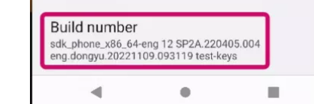
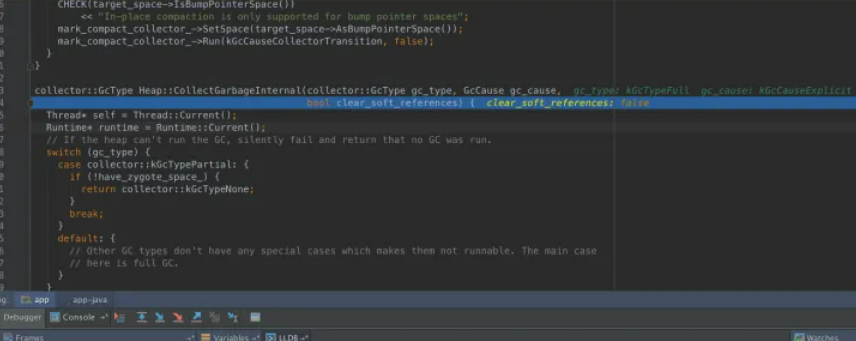
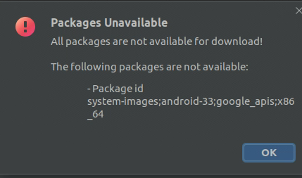
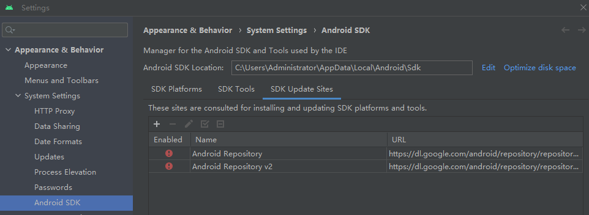

# 通过Android Studio搭建art debug环境

参考https://zhuanlan.zhihu.com/p/24867284

## 1. 简介

调试器在调试一个可执行文件的时候，必须知道一些调试信息才能进行调试，这个调试信息可多可少（也可以没有）。最直观的比如行号信息，如果调试器知道行号信息，那么在进行调试的时候就能知道当前执行到了源代码的哪一行，如果调试器还知道对应代码的源文件在哪，那么现代IDE的调试器一般就能顺着源码带你飞了，这就是所谓的源码调试。相反，如果没有行号和源码信息，那么只能进行更低级别的调试了，调试器只能告诉你一些寄存器的值；而当前运行的代码也只是PC寄存器所指向的二进制数据，这些数据要么是虚拟机指令，要么是汇编指令；这就是所谓的无源码调试。

**具体debug实现如下**

参考4. others

Android Studio 可以用来开发App，并可以debug App，具体是通过拉起一个[安卓虚拟设备](https://developer.android.com/studio/run/managing-avds?hl=zh-cn)（avd，可以虚拟物理机比如pixel 3），并将App attach到该avd用鼠标在avd上操作App。因此，在App中添加一个Button，每点击一次，就执行一次runtime gc，从而调用art中的代码，进而debug art。这里需要解决三个个问题：

- 运行可执行文件：art源码在编译后被打包进system.img，可通过指令拉起avd，并通过`-system`指定system.img
- 指定art模块的符号文件：在lldb通过`add-dsym`指定
- 绑定android studio 中本地art源码与art镜像：在lldb通过 settings set target.source-map $ANDROID_SOURCE $ANDROID_STUDIO_APP_SRC 进行绑定


## 2. 准备工作

### 2.1 art 源码下载与编译

#### failed

本例采用`android-9.0.0_r21`，下载源码的过程参考[pixel3 刷机过程](https://github.com/Ying-Yuan07/pixel3/blob/main/pixel%203%20%E5%88%B7%E6%9C%BA%E8%BF%87%E7%A8%8B.md) ，编译可在模拟器中运行的镜像，编译在pixel 3 物理机上需要执行`lunch aosp_blueline-userdebug` ,此处应该是`lunch aosp_x86-eng`

```shell
# android-9.0.0_r21 为aosp源码路径
cd android-9.0.0_r21
source build/envsetup.sh
lunch aosp_x86-eng
make -j64
```

生成在镜像在`$ANDROID_PRODUCT_OUT`路径下，其中`ANDROID_PRODUCT_OUT = android-9.0.0_r21/out/target/product/generic_x86`

`art`代码被编译进了`$ANDROID_PRODUCT_OUT/system-qemu.img`,

`$ANDROID_PRODUCT_OUT/symbols`路径下是个模块对应的符号文件.so,其中art对应的符号文件为`libart.so`

**注**：android-12 的环境对应的`lunch aosp_x86_64-eng`，因为在创建虚拟设备选择系统镜像时，其ABI为x86_64，`art`代码被编译进了`$ANDROID_PRODUCT_OUT/system.img`,


#### 2.1.1 art 源码下载与编译-success![10]

本例采用`android-12.0.0_r25`，下载源码的过程参考[pixel3 刷机过程](https://github.com/Ying-Yuan07/pixel3/blob/main/pixel%203%20%E5%88%B7%E6%9C%BA%E8%BF%87%E7%A8%8B.md) ，编译可在模拟器中运行的镜像，编译在pixel 3 物理机上需要执行`lunch aosp_blueline-userdebug` ,此处应该是`sdk_phone_x86_64`

```shell
# android-12.0.0_r25 为aosp源码路径
cd android-12.0.0_r25
source build/envsetup.sh
lunch sdk_phone_x86_64
make -j64
```

**镜像文件**：生成在镜像在`$ANDROID_PRODUCT_OUT`路径下，其中`ANDROID_PRODUCT_OUT = android-9.0.0_r25/out/target/product/emulator_x86_64`代码被编译进了`$ANDROID_PRODUCT_OUT/system-qemu.img`,

**符号文件**：`$ANDROID_PRODUCT_OUT/symbols`路径下是个模块对应的符号文件.so,其中art对应的符号文件为`libart.so`

#### 2.1.2共享 AVD 系统映像以供他人配合使用 Android Studio

```shell
$make -j32 sdk sdk_repo

[ 99% 541/543] build out/host/linux-x86/sdk/sdk_phone_x86_64/repository.xml
out/host/linux-x86/sdk/sdk_phone_x86_64/repository.xml validates
[100% 543/543] build out/host/linux-x86/sdk/sdk_phone_x86_64/repo-sys-img.xml
out/host/linux-x86/sdk/sdk_phone_x86_64/repo-sys-img.xml validates
```

此操作会在 `aosp-master/out/host/linux-x86/sdk/sdk_phone_x86` 下生成两个文件：

1.`sdk-repo-linux-system-images-eng.[username].zip`

2.`repo-sys-img.xml`

`sdk-repo-linux-system-images-eng.[username].zip` 压缩包包含模拟器启动系统锁需要的所有系统镜像。

解压该文件，其中有个文件夹`x86_64`。


### 2.2 Android Studio 

#### 2.2.1 安装Android Studio并配置SDK

- 安装Android Studio

  参考[官方教程](https://developer.android.com/studio/install?hl=zh-cn)

- 配置SDK

  ```
  可能出现网络问题，解决方案参考下文error 1)，SDK版本要和我们要调试art 所属android版本匹配
  Android Studio-->Android sdk -->SDK platforms： 选择Android 9.0(Pie) 28，SDK可以自动下载指定版本的SDK platforms到Android SDK Location指定的位置
  Android Studio-->Android sdk -->SDK Tools：选择需要下载的tools,下载位置同上
  ```

  

- 设置SDK环境变量

  [SDK](https://developer.android.com/studio/command-line?hl=zh-cn)中有模拟器emulator，platform-tools，以及可用于手动安装各种SDK的cmdline-tools

  设置SDK相关环境变量，以使SDK中的工具生效，其中ANDROID_HOME = ANDROID_SDK_ROOT = Android SDK Location

  `vim ~/vim .bashrc `

  ```shell
  export ANDROID_HOME="/home/yy/Android/Sdk"
  export ANDROID_SDK_ROOT="/home/yy/Android/Sdk"
  PATH="$ANDROID_HOME/emulator:$ANDROID_HOME/platform-tools:$ANDROID_HOME/cmdline-tools/latest/bin:${PATH}"
  ```

  `source ~/vim .bashrc `使添加的环境变量生效

​		执行`emulator`,判断SDK工具是否可用

#### 2.2.2 新建一个app

new project-->Empty Views Activity, 等待1-2mins，等待App项目初始化完成；

#### 2.2.3 在app中添加一个RuntimeGC按钮 

1）在$PROGECT_PATH/app/src/main/res/layout/activity_main.xml 中定义一个id=sample_text的button,button上写的内容为Debug

```xml
    <TextView
        android:layout_width="wrap_content"
        android:layout_height="wrap_content"
        android:text="Hello World!"
        app:layout_constraintBottom_toBottomOf="parent"
        app:layout_constraintEnd_toEndOf="parent"
        app:layout_constraintStart_toStartOf="parent"
        app:layout_constraintTop_toTopOf="parent" />
//defeine one button
    <Button
        android:id="@+id/sample_text"
        android:layout_width="wrap_content"
        android:layout_height="wrap_content"
        android:text="Debug" />
</androidx.constraintlayout.widget.ConstraintLayout>

```


2）修改$PROGECT_PATH/app/src/main/java/com/example/<app name>/MainActivity.java， 在onCreate函数中添加1）中定义的Button

```java
 @Override
    protected void onCreate(Bundle savedInstanceState) {
        super.onCreate(savedInstanceState);
        setContentView(R.layout.activity_main);
// add one button
        Button tv = (Button) findViewById(R.id.sample_text);
        tv.setOnClickListener(new View.OnClickListener() {
            @Override
            public void onClick(View view) {
                Runtime.getRuntime().gc();
                System.out.println("click button");
            }
        });

    }
```


#### 2.2.4 导入art源码

将2.1中下载的android-9.0.0_r21/art文件夹，拷贝到$PROGECT_PATH/app/src

#### 2.2.5 将art的符号文件拷贝到App项目

在$PROGECT_PATH/app下新建image文件夹，将art的符号文件$ANDROID_PRODUCT_OUT/symbols/system/*/libart.so拷贝到image文件夹下

*：lib 或者lib64，根据avd的为数而定

#### 2.2.6 修改Run/Debug Configuration

debugger-->Debug type：选择Native Only，或者 Daul(Java + native)：可以同时debug app 与native代码

debugger-->Symbol Directories：选择编译art模块生成的符号文件所在路径，即$ANDROID_PRODUCT_OUT/symbols/system/lib 或者$ANDROID_PRODUCT_OUT/symbols/system/lib64，根据avd的系统架构而定


#### 2.2.7 创建指定API的avd

参考[官方教程](https://developer.android.com/studio/run/managing-avds?hl=zh-cn)

这里我们选择pixel3 android 9，创建完成后，可以通过`emulator -list-avds`查看avd name


## 3. Debug

### 3.1 启动模拟器，运行编译生成的镜像

#### failed

【！！avd 并没有真的加载指定的镜像，还是运行的原生镜像】

art源码在编译后被打包进`$ANDROID_PRODUCT_OUT/system.img`（或者system-qemu.img），可通过指令拉起avd，并通过`-system`指定system.img，在Android Studio的Terminal执行

```shell
emulator -avd <avd name> -verbose -no-boot-anim -system /path/to/system.img
```

成功的话，会出现一个手机界面

#### success！[10]

在Android Studio的Terminal执行

```shell
emulator -avd <avd name> -verbose -no-boot-anim -sysdir x86_64/
```

`x86_64/`为`2.1.2`中解压出的镜像目录

成功的话，会出现一个手机界面，点开【setting】-->【about phone】->【build number】,可以看到编译镜像的时间与host user,即avd加载了目标镜像。




### 3.2 debug app

点击Android Studio debug按钮，将2.2.2中创建的App attach到3.1中的avd，

Android Studio的Debug窗口会自动弹出来，如下：


我们点击那个 `pause program` 按钮，可以**让程序暂停运行**,可以看到堆栈信息，并可以进入lldb


上图左边是正在运行的线程的堆栈信息，右边有两个tab，一个用来显示变量的值；一个是lldb交互式调试窗口！我们先切换到lldb窗口，输入如下命令设置一个断点：

```bash
(lldb) br s -n CollectGarbageInternal

Breakpoint 2: where = libart.so`art::gc::Heap::CollectGarbageInternal(art::gc::collector::GcType, art::gc::GcCause, bool), address = 0xb4648c20
```

可以看到，断点已经成功设置；这个断点在libart.so中，不过现在还没有调试符号信息以及源码信息，我们只知道它的地址。接下来我们设置调试符号以及关联源码。

### 3.3 打开avd


### 3.4 指定art模块的符号文件

接下来我们把编译得到的符号文件 libart.so 告诉调试器（符号文件和真正的动态链接库这两个文件名字相同，只不过一个在编译输出的symbols目录) ；在lldb窗口执行：

```bash
(lldb) add-dsym $ANDROID_PRODUCT_OUT/symbols/system/lib/libart.so

symbol file '/home/yy/AndroidStudioProjects/artDebugAndroid9/app/symbols/libart.so' has been added to '/home/yy/.lldb/module_cache/remote-android/.cache/94D991E8-E17D-8845-CF50-F77D43C3D31F/libart.so'
```

注：对于android 12 art 模块的符号文件为`$ANDROID_PRODUCT_OUT/symbols/apex/com.android.art.debug/lib64/libart.so`


注意后面那个目录你的机器上与我的可能不同，需要修改一下。我们再看看有什么变化，看一下刚刚的断点：

```bash
(lldb) br list 2

2: name = 'CollectGarbageInternal', locations = 1, resolved = 1, hit count = 0

  2.1: where = libart.so`art::gc::Heap::CollectGarbageInternal(art::gc::collector::GcType, art::gc::GcCause, bool) **at heap.cc:2124**, address = 0xb4648c20, resolved, hit count = 0 
```

行号信息已经加载出来了！！在 `[http://heap.cc](https://link.zhihu.com/?target=http%3A//heap.cc)` 这个文件的第2124行。不过如果这时候断点命中，依然无法关联到源码。

### 3.5 绑定android studio 中本地art源码与art镜像

我们需要映射一下；在Android Studio的Debug 窗口的lldb 那个tab执行如下命令：

```shell
(lldb) setting set target.source-map /home/yy/workspace/pixel3_all/aosp9-bak/art /home/yy/AndroidStudioProjects/artDebugAndroid9/app/src/art
```

第一个参数的意思是art编译时候的目录信息，第二个参数是你机器上的源码存放路径；设置成自己的即可。


这时候，我们再触发断点（**点击demo项目的Debug按钮**），看看发生了什么？！



至此，我们已经成功滴完成了在Android Studio中Native代码的源码调试。你可以像调试Java代码一样调试Native代码，step/in/out/over，条件断点，watch point任你飞。你可以借助这个工具去探究Android底层运行原理，比如垃圾回收机制，对象分配机制，Binder通信等等，完全不在话下！


## 4. others

- system.img 这个文件是做什么用的

  ```
  system.img文件是Android操作系统的一部分，包含了Android系统的大部分核心代码和应用程序，以及其他预装软件和驱动程序等。它是Android操作系统的一个系统镜像文件，可以被烧录到Android设备的分区中。当设备启动时，它会从system.img文件中加载操作系统和应用程序。这个文件对于Android设备的正常运行是非常重要的。
  ```

- 使用安卓源码编译时，生成的libart符号文件在哪个路径下

  ```
  在使用 Android 源码编译时，生成的 libart.so 符号文件通常会存储在 $ANDROID_PRODUCT_OUT/symbols/system/lib64 目录下，其中 $ANDROID_PRODUCT_OUT 是 Android 编译的输出目录。这个目录会在执行 lunch 命令后根据当前选择的编译目标进行设置。如果是通用的 AOSP 编译，libart.so 符号文件的路径可能会有所不同，但通常也在 $ANDROID_PRODUCT_OUT/symbols/system/lib64 目录下。
  ```

- symbols/system/lib64/libart.so这个文件包含了调试所需要的所有信息么

  ```
  在 Android 源码编译生成 libart.so 文件时，可以通过设置 -g 参数生成包含调试信息的符号文件，符号文件默认被保存在 out/target/product/<device>/symbols/system/lib64/libart.so 路径下。但是，并不是所有的调试信息都会被包含在该符号文件中，因为符号文件中只包含了编译时生成的调试信息，而不包括运行时生成的调试信息。
  
  因此，如果要在符号文件中包含所有的调试信息，可以在编译时使用 -g2 参数。不过需要注意的是，生成包含所有调试信息的符号文件会增加文件大小，可能会占用更多的磁盘空间。
  ```

- 如何查看这个文件symbols/system/lib64/libart.so，是通过-g 参数，还是-g2参数编译生成的

- lldb 查看已经加载的模块:image list

- 当执行add-dsym out/target/product/<device>/symbols/system/lib64/libart.so 时，提示“does not match any existing module"

  ​	编译art时，lunch 选项与启动的模拟器架构不匹配，模拟器的镜像与add-dsym的符号文件不匹配

  ​	比如pixel 3 API 28的avd，其架构为x86，因此编译时应执行`lunch aosp_x86-eng`,其编译结果在`android-9.0.0_r21/out/target/product/generic_x86`

- 我再给你提供一些我认为有用的信息，你将作为一个android内核的专家，再次帮我解答上面的问题。使用image list命令，可以看到已经加载的libart.so在.lldb/module_cache/remote_android/.cache/xxx/目录下，文件大小为8063660。我通过内核编译生成的libart.so文件在 out/target/product/<device>/symbols/system/lib64/libart.so，且文件是有编译符号的，文件大小为1556444296，明显文件比较大。 当执行add-dsym out/target/product/<device>/symbols/system/lib64/libart.so 时，提示“does not match any existing module"。

- android studio中如何设置自己编译生成的system.img：参考3.1

- 这个文件.lldb/module_cache/remote_android/.cache/xxx/libart.so是如何生成的，和system.img什么关系，我可以直接把这个文件替换成我编译生成的libart.so文件么

- 怎样将自己编译的libart.so文件复制到虚拟设备上: adb shell push 到设备上对应的位置即/system/lib

- 怎么连接自己的虚拟设备: adb shell

- adbd cannot run as root in production builds 

   和pixel3 物理机一样，点击build number 进入开发者模式，打开 Debugging: USB debug、wait for debugger、select debug app 选择在Android Studio中拉起的App

- lldb breakpoint list列出的断点信息应该如何理解

- 每个断点后面会有多个where信息，如何理解

- lldb no debug info for the selected frame


## error





### 1) SDK manager 不显示可下载SDK，创建AVD时，system image 不显示可下载镜像

#### 问题描述与分析

切换到SDK manager-->SDK update sites,可以看到android repository 无法访问，检查服务器是否可以访问android repository，

```shell
wget https://dl.google.com/android/repository/repository2-3.xml
ping dl.google.com
```

服务器可以访问android repository，但是`ping dl.google.com`不通，根据教程[3]解决ping不通问题

**PS**:根据网上教程修改android studio->file->setting->HTTP Proxy的方法通通不起作用！！





#### 解决方案

**ping不通 dl.google.com[3]**

首先进入 [http://ip.tool.chinaz.com/dl.google.com](https://links.jianshu.com/go?to=http%3A%2F%2Fip.tool.chinaz.com%2Fdl.google.com)


将获取的ip地址拷贝下载,这里是 203.208.40.33

打开/etc/hosts添加

203.208.40.33 dl.google.com

完成！！！

#### 结果

android studio 可以访问android repository了，SDK manager 成功显示可下载SDK，创建AVD时，system image 显示可下载镜像


### 2)**创建avd，出现/dev/kvm device permission denied[4]**


This is how I got it to work in **Ubuntu 18.04**

```
sudo apt install qemu-kvm
```

Add your user to kvm group using:

```
sudo adduser <Replace with username> kvm
```

To check which users are in the `kvm` group, use

```
grep kvm /etc/group
```

This returned

```
kvm:x:134:yy
```

user yy is added in the  `kvm` group successfully!,and try to create an avd again,if the  permission is still denied,**restart the server**，it works!!!!!!!!


If still showing *permission denied*:

```
sudo chown <Replace with username> /dev/kvm
```

Try it.


### 3）Android Studio解决Error:moudle not specified

当配置run/debug configuration时，出现Error:moudle not specified

解决方案见教程[5] [6]

PS：先清缓存重启AS试试看，Idea家族有缓存bug


### 4）build时，failed to find build tools revision 30.0.3

解决方案参考[7]


### 5）build时，Coud not identify launch activity: Default Activity not found

分析：创建工程的时候选错了

解决方案参考[8], new project--> empty activity

### 6）创建empty activity 无法选择语言

解决方案参考[9]

如果您将选择Empty Activity（空活动）选项，那么它将在只支持Kotlin的Jetpack Compose的支持下创建默认的“活动”。创建您习惯的Empty Activity，请向下单击Empty Views Activity。

### 7) 无法理解的问题

Android studio 是基于JetBrain IDEA实现的，因此和idea一样，软件的缓存会导致各种莫名其妙的问题，清缓存可以解决90%的问题。

清除Android studio缓存，并将其重启！！

Android studio-->file-->Invalidate Caches-->Invalidate and Restart


## refs

[1] https://zhuanlan.zhihu.com/p/24867284

[2] https://www.jianshu.com/p/ac474d8b8ac5

[3] https://www.jianshu.com/p/10a21a214303

[4] https://stackoverflow.com/questions/37300811/android-studio-dev-kvm-device-permission-denied

[5] https://blog.csdn.net/ldld1717/article/details/52024863

[6] https://www.geeksforgeeks.org/fix-module-not-specified-error-in-android-studio/

[7] https://blog.csdn.net/qq_45300044/article/details/120810351

[8] https://blog.csdn.net/yanceyxin/article/details/109863146

[9] https://www.logfault.com/thread-4008.htm

[10] ruby, 构建Android模拟器系统运行镜像, https://zhuanlan.zhihu.com/p/545947820 , 2022.12.09  

[11] 昨夜星辰_zhangjg, 使用Android模拟器调试linux内核, https://blog.csdn.net/zhangjg_blog/article/details/84291663?spm=1001.2101.3001.6650.1&utm_medium=distribute.pc_relevant.none-task-blog-2%7Edefault%7ECTRLIST%7ERate-1-84291663-blog-119890214.235%5Ev36%5Epc_relevant_default_base3&depth_1-utm_source=distribute.pc_relevant.none-task-blog-2%7Edefault%7ECTRLIST%7ERate-1-84291663-blog-119890214.235%5Ev36%5Epc_relevant_default_base3&utm_relevant_index=2 , 2018.11.27
